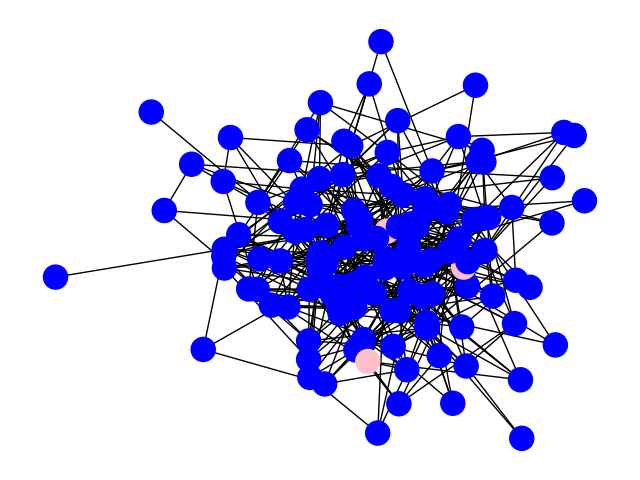

# Rendu DM Andrieu Taffin

## Parcour en largeur
Start : 1, End : 30  

  

## Parcour en profondeur bornée
Start : 1, End : 30  

  

## Parcour Astar
Start : 1, End : 30  

  

## Parcour RBFS
Start : 1, End : 30  

  

En moyenne, sur un chemin optimal long, les parcours Astar et RBFS sont plus rapide que le parcours en largeur. Sur un chemin optimal cours, le parcours en largeur devient le plus rapide. Dans les 2 cas, le parcours en profondeur est le plus lent.
Pour le cas du chemin optimal long, les parcours Astar et RBFS l'emportent car ils parcourent beaucoup moins de noeuds que le parcours en largeur.
Pour le cas du chemin optimal court, la différence du nombre de noeud parcourus n'est pas significative et le parcours en largeur devient alors plus rapide car les calculs d'heuristiques prennent du temps.
